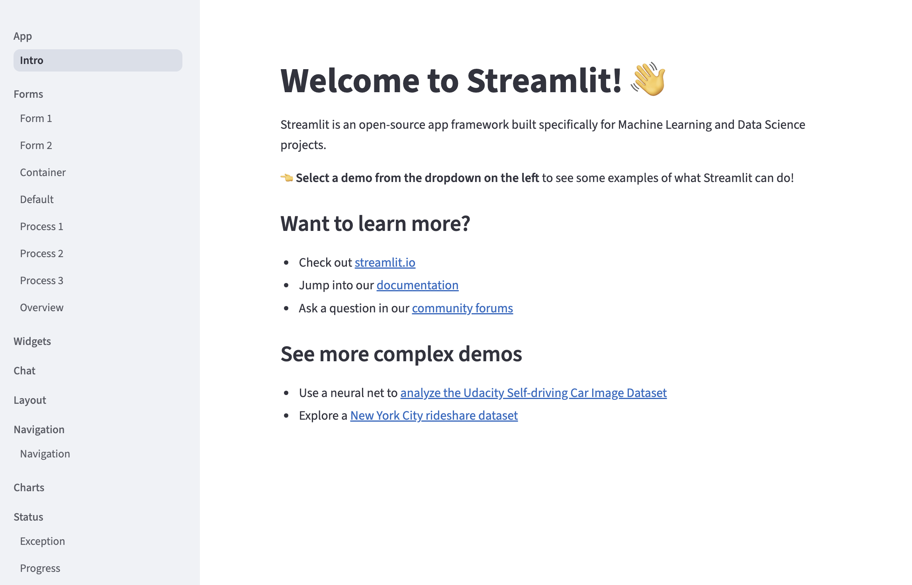

# STREAMLIT APP




## Übersicht

Dieses Streamlit-Projekt enthält verschiedene Beispielanwendungen, die im `src`-Verzeichnis organisiert sind. Jede Beispiel-App demonstriert ein spezifisches Feature oder eine Funktion von Streamlit.

## Beispiele im `src`-Ordner

Die folgenden Beispiele sind verfügbar:

- Einfache Streamlit-App mit Textausgabe und Button.
- Demonstriert die Verwendung von Diagrammen und Datenvisualisierung.
- Zeigt, wie man Benutzereingaben verarbeitet und dynamische Inhalte erstellt.
- Beispiel für die Integration von Bildern und Medien.
- Erweiterte Layouts und Seitenstruktur mit Streamlit.


## Nutzung

Um eine Beispiel-App auszuführen, verwenden Sie folgenden Befehl im Terminal:

```bash
streamlit run app.py
```

## Voraussetzungen

- Python 3.11+
- Streamlit installiert (`pip install streamlit`)

## Weitere Informationen

Weitere Dokumentation und Screenshots finden Sie im `doc`-Ordner.